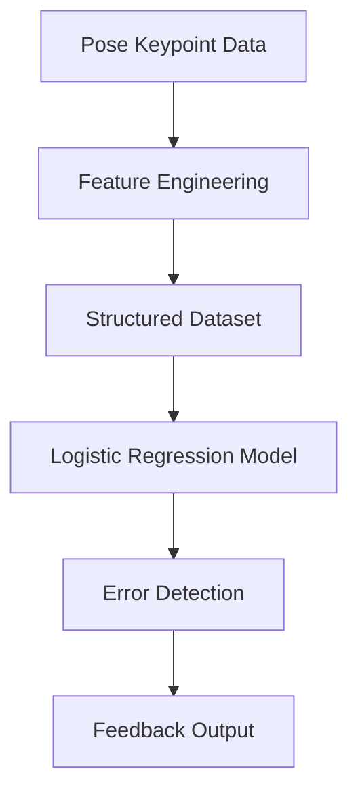

# 🏏 Multimodal Cricket Motion Analysis

<p align="center">
  <b>AI-powered analysis of cricket bowling actions using pose-based features and machine learning</b>
</p>

<p align="center">
  
  
  
  
  
</p>

---

## 📌 Overview

Analyzing cricket bowling techniques manually is subjective and time-consuming.
This project provides an automated system that evaluates bowling actions using **pose-based motion data** and machine learning.

---

## 💡 Solution Approach

The system uses pre-extracted body keypoints to represent a bowler’s motion.
These keypoints are transformed into structured features and fed into a machine learning model to classify and detect errors in the bowling action.

---

## 🎯 Features

* Pose-based motion analysis
* Feature extraction from body keypoints
* Classification using Logistic Regression
* Detection and classification of bowling action errors
* Automated performance feedback

---

## ⚙️ How It Works

The system takes pose keypoint data as input, converts it into structured features, and uses a trained Logistic Regression model to classify bowling actions and detect errors.

---

## 🔄 Workflow



---

## 🏗️ Tech Stack

| Category         | Technology Used |
| ---------------- | --------------- |
| Language         | Python          |
| Computer Vision  | OpenCV          |
| Pose Estimation  | MediaPipe       |
| Machine Learning | Scikit-learn    |
| Data Processing  | NumPy, Pandas   |

---

## 📥 Input

* Pre-extracted pose keypoints (e.g., MediaPipe output)
* Numerical feature vectors representing motion
* Structured dataset of bowling actions

---

## 📤 Output

* Classification of bowling action
* Detection of errors
* Feedback for performance improvement

---

## 🖼️ Results

### 📥 Input Data

<p align="center">
  
</p>

### 📊 Model Output

<p align="center">
  
</p>

### 🎥 Pose Visualization

[▶️ Click to watch pose estimation output](assets/pose_output.mp4)

---

## 📦 Requirements

* Python 3.x
* OpenCV
* MediaPipe
* Scikit-learn
* NumPy
* Pandas

---

## 🛠️ Installation

```bash
git clone https://github.com/Gayathri0-0/multimodal-cricket-motion-analysis.git
cd multimodal-cricket-motion-analysis
pip install -r requirements.txt
```

---

## ▶️ Usage

```bash
python main.py
```

---

## 📁 Project Structure

```
multimodal-cricket-motion-analysis/
├── data/              # Dataset and keypoints  
├── models/            # Trained models  
├── src/               # Source code  
├── main.py            # Entry point  
├── requirements.txt  
└── README.md  
```

---

## 🌍 Applications

* Cricket coaching and training
* Player performance analysis
* Sports biomechanics research
* Automated feedback systems

---

## ⚠️ Limitations

* Depends on accuracy of pose keypoint data
* Limited dataset may affect generalization
* Does not process raw video directly
* Temporal dynamics are not deeply modeled

---

## 🚀 Future Scope

* Integration of deep learning models (CNN / LSTM)
* Real-time analysis system
* Larger and more diverse dataset
* Advanced biomechanical insights
* Error severity scoring

---

## 👩‍💻 Team & Contributions

- **Chinmay Dadhich** ([GitHub](https://github.com/)) – 
- **Nikhil Jangir** ([GitHub](https://github.com/username)) – 
- **Madhvi Gupta** ([GitHub](https://github.com/username))   – Literature survey and research 
- **Gayathri** ([GitHub](https://github.com/username)) - Github Repository
- **Parag Kabara** ([GitHub](https://github.com/username))  – Presentation and Report

---

## ⭐ Show Your Support

If you found this project useful, consider giving it a ⭐ on GitHub!
