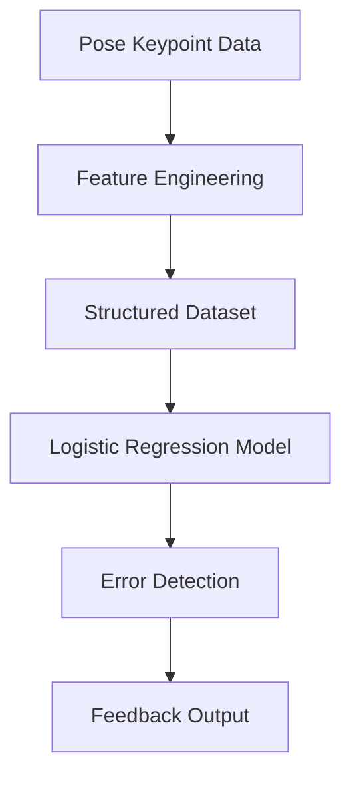
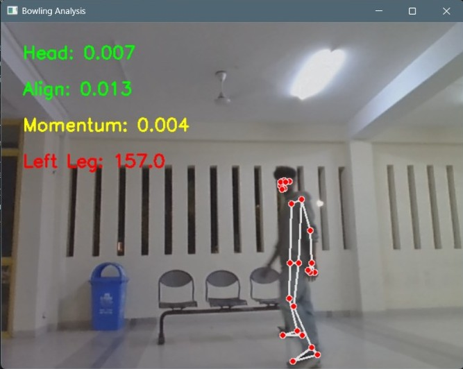
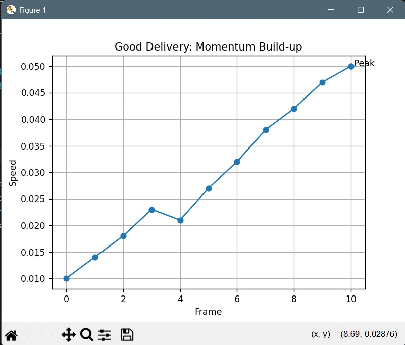
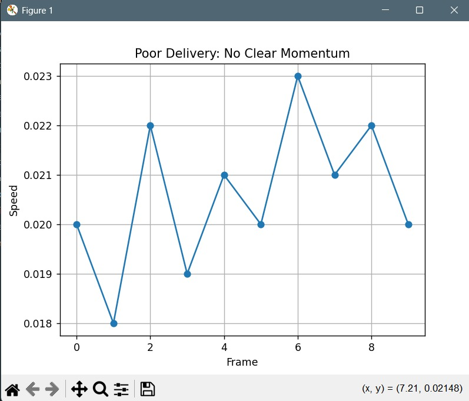
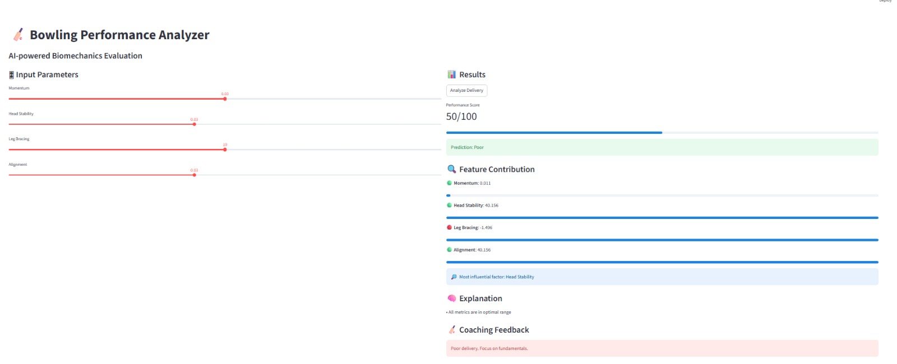

# 🏏 Multimodal Cricket Motion Analysis

<p align="center">
  <b>AI-powered analysis of cricket bowling actions using pose-based features and machine learning</b>
</p>

<p align="center">
  
  
  
  
  
</p>

---

## 📌 Overview

Analyzing cricket bowling techniques manually is subjective and time-consuming.
This project provides an automated system that evaluates bowling actions using **pose-based motion data and machine learning**, enabling objective and consistent analysis.

---

## 💡 Solution Approach

The system uses **pre-extracted body keypoints** (e.g., from MediaPipe) to represent a bowler’s motion.

These keypoints:

* Represent body joint positions
* Are converted into structured numerical features
* Are used in a **Logistic Regression model** for classification and error detection

---

## 🎯 Features

* Pose-based motion analysis
* Feature extraction from body keypoints
* Classification using Logistic Regression
* Detection and classification of bowling action errors
* Automated performance feedback

---

## ⚙️ How It Works

The system takes pose keypoint data as input, converts it into structured features, and uses a trained Logistic Regression model to classify bowling actions and detect errors.

---

## 🔄 Workflow



---

## 🏗️ Tech Stack

| Category         | Technology Used |
| ---------------- | --------------- |
| Language         | Python          |
| Computer Vision  | OpenCV          |
| Pose Estimation  | MediaPipe       |
| Machine Learning | Scikit-learn    |
| Data Processing  | NumPy, Pandas   |

---

## 📥 Input

* Pre-extracted pose keypoints (e.g., MediaPipe output)
* Numerical feature vectors representing motion
* Structured dataset of bowling actions

---

## 📤 Output

* Classification of bowling action
* Detection of errors
* Feedback for performance improvement

---

## 🖼️ Results

### 📥 Input Data

<p align="center">
  
</p>

---

### 📊 Model Outputs

<p align="center">
  
  
  
</p>

---

## 📦 Requirements

* Python 3.x
* OpenCV
* MediaPipe
* Scikit-learn
* NumPy
* Pandas

---

## 🛠️ Installation

```bash
git clone https://github.com/Gayathri0-0/multimodal-cricket-motion-analysis.git
cd multimodal-cricket-motion-analysis
pip install -r requirements.txt
```

---

## ▶️ Usage

1. **Prepare Input Data**

   * Ensure pre-extracted pose keypoint data (dataset) is available
   * Place the dataset inside the `data/` folder

2. **Run the Program**

```bash
python main.py
```

3. **Output**

   * The model processes the input features
   * Classifies bowling actions
   * Detects errors and provides feedback

---

## 📁 Project Structure

```
multimodal-cricket-motion-analysis/
├── data/                  # Dataset and pose keypoints  
├── assets/                # Input & output images  
├── main.py                # Main execution script  
├── pose_detection.py      # Extracts pose keypoints from video  
├── data_extraction.py     # Converts keypoints into structured features  
├── train_model.py         # Trains Logistic Regression model  
├── integrated_from_csv.py # Runs predictions using dataset  
├── data_logger.py         # Logs and stores processed data  
├── metrics.py             # Evaluates model performance  
├── plot_momentum.py       # Generates analysis/visual plots  
├── requirements.txt       # Project dependencies  
└── README.md  
```


---

## 🌍 Applications

* Cricket coaching and training
* Player performance analysis
* Sports biomechanics research
* Automated feedback systems

---

## ⚠️ Limitations

* Depends on accuracy of pose keypoint data
* Limited dataset may affect generalization
* Does not process raw video directly
* Temporal dynamics are not deeply modeled

---

## 🚀 Future Scope

* Integration of deep learning models (CNN / LSTM)
* Real-time analysis system
* Larger and more diverse dataset
* Advanced biomechanical insights
* Error severity scoring

---

## 👩‍💻 Team & Contributions

* **Chinmay Dadhich** – Coding
* **Nikhil Jangir** – Coding
* **Madhvi Gupta** – Literature survey and research
* **Gayathri** – GitHub repository management
* **Parag Kabara** – Presentation and documentation

---

## ⭐ Show Your Support

If you found this project useful, consider giving it a ⭐ on GitHub!
